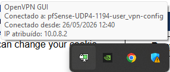
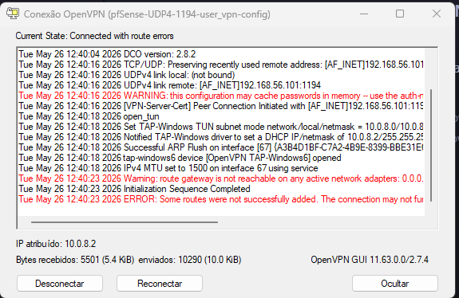
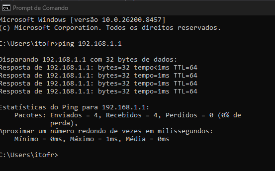

# VPN Host-to-Gateway com pfSense e OpenVPN

Este repositório contém a implementação prática, documentação técnica, roteiro de testes e arquivo de perfil configurado para o laboratório de **VPN Host-to-Gateway (Client-to-Site)**. O projeto foi desenvolvido simulando um Gateway corporativo em máquina virtual pfSense (FreeBSD) e um cliente externo via Windows físico (Host).

---

## 🗺️ Mapa do Repositório e Sumário

Acesse rapidamente os arquivos do projeto através dos links abaixo:

1. **Perfil de Configuração VPN (.ovpn):**
   * [pfSense-UDP4-1194-user_vpn-config.ovpn](pfSense-UDP4-1194-user_vpn-config.ovpn) — Perfil gerado pelo pfSense contendo todos os certificados (CA, Certificado do Usuário, Chave Privada) embutidos no formato inline para importação direta no cliente OpenVPN.
2. **Relatório Técnico de Implantação:**
   * [docs/relatorio_fase0.md](docs/relatorio_fase0.md) — Documentação completa dividida em etapas técnicas, com mais de 35 capturas de tela explicando o setup do pfSense, a criação da PKI, a configuração do túnel OpenVPN, regras de firewall e resolução de problemas (Troubleshooting).
3. **Roteiro Prático de Testes e Comandos:**
   * [docs/roteiro_testes.md](docs/roteiro_testes.md) — Roteiro de testes com comandos CMD e PowerShell para auditoria, verificação da tabela de rotas locais, pings para a rede protegida e traceroute do túnel.
4. **Plano de Implementação Inicial:**
   * [docs/implementation_plan.md](docs/implementation_plan.md) — O design arquitetural original e topologia lógica do laboratório de rede.

---

## 📸 Provas de Sucesso da VPN (Prints de Validação)

Abaixo estão anexados os registros gráficos que atestam o pleno funcionamento da conexão criptografada e o correto roteamento de pacotes para a rede privada isolada:

### 1. Estabelecimento da Conexão (OpenVPN Client)
O cliente OpenVPN GUI no Windows Host realizou a autenticação do usuário `user_vpn` com sucesso e obteve o IP virtual **`10.0.8.2`** na placa virtual de rede.

### 2. Logs Técnicos de Handshake e Tunneling
Logs do cliente confirmando a negociação dos ciphers e a criação bem-sucedida do adaptador virtual com IP e rotas configuradas.

### 3. A Prova de Fogo: Ping para a LAN protegida (`192.168.1.1`)
Com o túnel estabelecido, o Windows físico conseguiu pingar a interface LAN do pfSense (`192.168.1.1`), rede que é fisicamente isolada e inalcançável sem a VPN ativa, obtendo **0% de perda** de pacotes.

---

## ⚙️ Instruções de Execução Rápida

1. **Preparação:** Configure as placas de rede da VM do pfSense no VirtualBox (Adaptador 1 como Host-Only e Adaptador 2 como Rede Interna).
2. **Iniciar:** Ligue a VM do pfSense e garanta que o painel administrativo responda no IP `https://192.168.56.101`.
3. **Cliente:** Instale o OpenVPN GUI no seu Windows físico.
4. **Perfil:** Importe o arquivo [pfSense-UDP4-1194-user_vpn-config.ovpn](pfSense-UDP4-1194-user_vpn-config.ovpn) no OpenVPN GUI.
5. **Conexão:** Clique em **Conectar**, insira as credenciais (`user_vpn` / `vpn`) e verifique o ícone verde.
6. **Teste:** Abra o prompt de comando (CMD) do Windows físico e rode `ping 192.168.1.1`.
