# Relatório Técnico - Fase 0: Planejamento, Análise e Instalação de Infraestrutura (pfSense & VMs)

Este relatório documenta a **Fase 0 (Fundação)** do projeto de implementação de uma VPN **Host-to-Gateway (Client-to-Site)**. Ele detalha o estudo das máquinas virtuais disponíveis, a tomada de decisão arquitetural, o processo de automação de provisionamento e o passo a passo ilustrado de instalação do firewall pfSense.

---

## 1. Análise e Estudo das Máquinas Virtuais Existentes

No início do laboratório, o professor disponibilizou um conjunto de máquinas pré-existentes. Analisamos as configurações de hardware virtual e redes de três VMs específicas no hypervisor Oracle VirtualBox:

### 1.1. VM `Fw_lpfw` (FreeBSD 64-bit)
* **Objetivo Original:** Servir como Firewall utilizando o mecanismo `ipfw` do FreeBSD.
* **Configuração de Rede:** Três adaptadores de rede, todos configurados no modo **Host-Only** (Rede exclusiva de hospedeiro).
* **Interface:** Modo texto puro (CLI - Command Line Interface), sem ambiente gráfico ou WebGUI pré-configurado.
* **Captura Técnica:**
  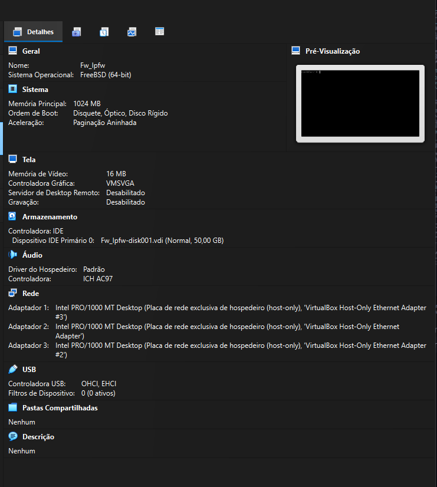

### 1.2. VM `Fw_iptables` (Debian 12 Bookworm)
* **Objetivo Original:** Servir como Firewall baseado em regras de `iptables` no ecossistema Linux.
* **Configuração de Rede:** Três adaptadores (NAT, Rede Interna `intnet` e Placa em modo Bridge).
* **Captura Técnica:**
  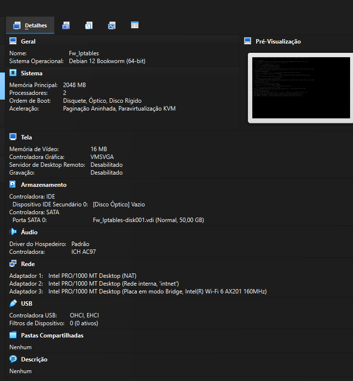

### 1.3. VM `Kali_Unitins` (Debian 64-bit - Kali Linux)
* **Objetivo:** Servir como o **Cliente Interno (Target)** localizado na rede local segura (LAN) atrás do firewall.
* **Configuração de Rede:** Um adaptador configurado em **Rede Interna** (nomeada `intnet`).
* **Captura Técnica:**
  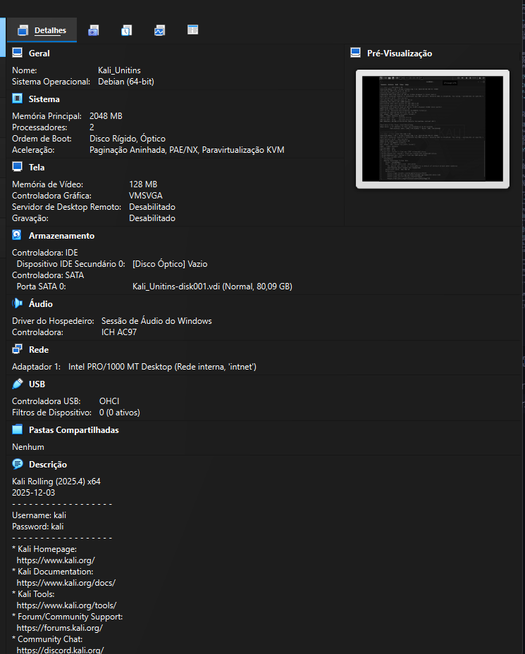

---

## 2. Decisão de Arquitetura e Abordagem de Implementação

Comparando as duas opções para o Firewall/Gateway VPN (usar as VMs prontas do professor ou criar uma nova infraestrutura com pfSense):

1. **Abordagem CLI Puro (FreeBSD / `ipfw`):** 
   Ao ligar a VM `Fw_lpfw`, fomos direcionados a um console de comando básico:
   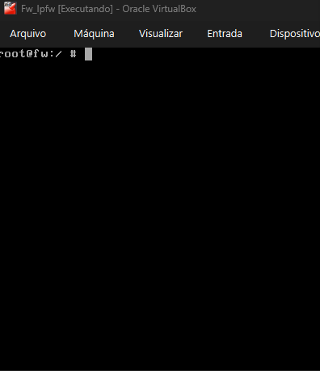
   Configurar uma CA (Autoridade Certificadora), gerar pares de chaves criptográficas de cliente/servidor, escrever arquivos de configuração do OpenVPN na mão e definir regras de firewall/NAT via terminal se provou um processo complexo, propenso a erros de sintaxe e de difícil replicação acadêmica.

2. **Abordagem de Firewall pfSense (Adotada):**
   Optamos por implantar o **pfSense CE 2.7.2** (também baseado em FreeBSD). O pfSense oferece uma interface Web (WebGUI) robusta que simplifica a administração das regras de firewall e possui um assistente nativo (Wizard) para o OpenVPN, o que minimiza falhas humanas de configuração e acelera o processo de exportação do perfil do cliente (`.ovpn`).
   A VM `Kali_Unitins` foi mantida para atuar como o nosso cliente interno na rede `intnet`.

---

## 3. Automação e Provisionamento das Novas VMs

Para garantir rapidez e padronização das máquinas, utilizamos o script PowerShell `setup_lab.ps1` no Windows Host.

Durante a execução inicial, o descompactador nativo do Windows (`tar.exe`) tentou extrair a estrutura interna do arquivo `.iso.gz` em vez de apenas descompactá-lo, resultando em uma árvore poluída de arquivos no workspace:
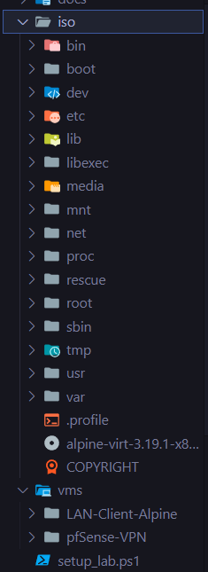

### Correção no Script
Ajustamos o script para usar o assembly `.NET` nativo `System.IO.Compression.GZipStream` para a descompressão. Isso garantiu a integridade do arquivo `pfSense-CE-2.7.2-RELEASE-amd64.iso` sem a extração indevida dos arquivos internos. O script então automatizou com sucesso:
* O download do pfSense e do Alpine Linux.
* A criação das VMs `pfSense-VPN` (1GB RAM, 8GB de HD, Adaptador 1: Host-Only, Adaptador 2: Rede Interna `intnet`) e `LAN-Client-Alpine` (como alternativa ultra-leve de cliente interno).
* O vínculo correto dos discos rígidos virtuais (`.vdi`) e mídias de instalação (`.iso`) em suas respectivas controladoras.

---

## 4. Passo a Passo da Instalação do pfSense (Ilustrado)

Após o provisionamento das novas máquinas no VirtualBox, a VM `pfSense-VPN` foi iniciada para o processo de instalação do sistema operacional.

### Passo 4.1: Seleção do Tipo de Dispositivo ZFS
No menu de particionamento ZFS, selecionou-se a opção padrão de agrupamento em listra virtual (sem redundância de discos físicos), ideal para ambientes de testes e laboratórios de virtualização de um único disco virtual.
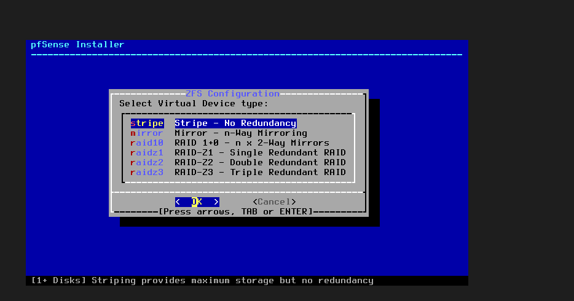

### Passo 4.2: Marcação e Seleção do Disco Rígido Virtual (`ada0`)
Na tela de seleção de discos para escrita do ZFS Pool, o disco virtual de 8GB (`ada0 - VBOX HARDDISK`) foi ativado pressionando a **Barra de Espaço** no teclado (gerando a marcação `[*]`), permitindo a gravação do sistema operacional.
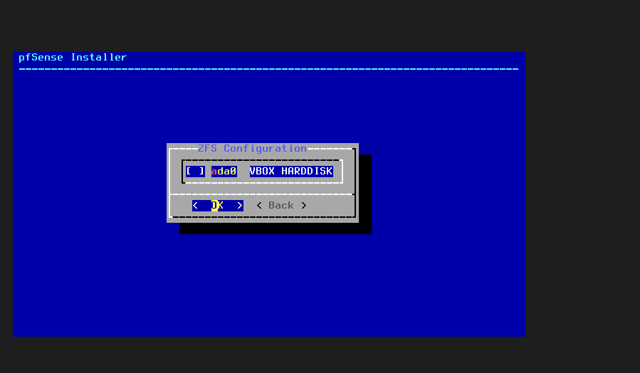

### Passo 4.3: Confirmação Destrutiva de Escrita
Uma última tela de confirmação de segurança foi apresentada para validar a formatação do volume virtual selecionado. A opção `< YES >` foi acionada para dar início à cópia de arquivos do sistema.
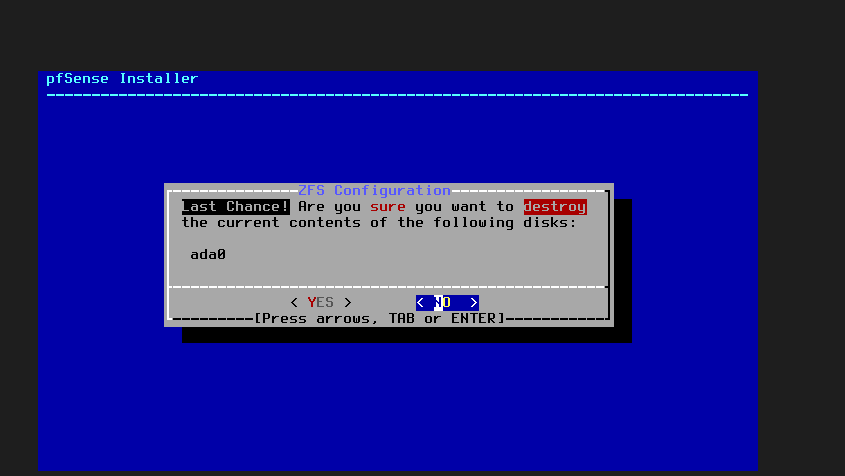

### Passo 4.4: Resolução de Loop de Boot (Ejeção da ISO)
Ao reiniciar, a máquina virtual pode acabar carregando o instalador a partir do leitor de CD/DVD virtual novamente.
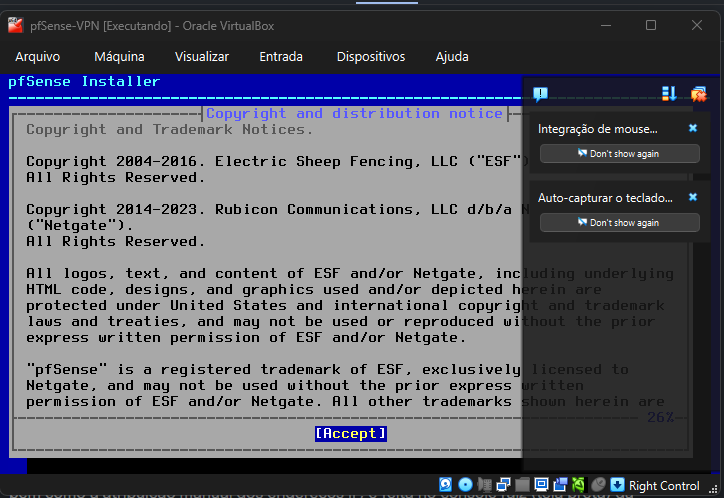

Para solucionar esse loop e carregar o pfSense instalado no disco rígido virtual:
1. Vá no menu da janela da máquina virtual em **Dispositivos > Dispositivos Ópticos**.
2. Clique em **Remover disco do drive virtual** (se aparecer uma mensagem de confirmação de força, confirme).
3. Vá no menu **Máquina > Reinicializar** para reiniciar a VM pelo HD.

---

### Passo 4.5: Inicialização e Menu Principal do pfSense
Após o reinício pelo HD, o pfSense inicializa e apresenta o menu principal de controle do console. A tela exibe o mapeamento automático das placas de rede e os IPs atribuídos a cada interface:
* **Interface WAN (em0):** Recebeu o IP `192.168.56.101/24` via DHCP (da rede Host-Only do VirtualBox).
* **Interface LAN (em1):** Definida com o IP estático padrão `192.168.1.1/24` (para a rede interna `intnet`).

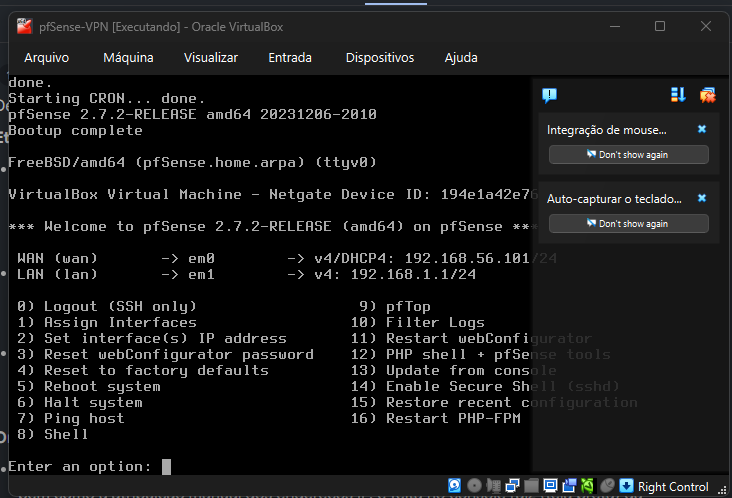

---

## 5. Próximos Passos (Fase 1 - Acesso Web e Configuração da VPN)

1. **Liberar Acesso Web Temporário:**
   Como estamos acessando pela interface WAN (pelo IP `192.168.56.101`), o pfSense bloqueia a WebGUI por padrão. No console da VM, entraremos na opção **`8) Shell`** e rodaremos o comando:
   ```bash
   pfctl -d
   ```
   *(Isso desativa a filtragem do firewall temporariamente para que possamos logar pelo navegador).*

2. **Acessar a WebGUI:**
   Abriremos o navegador no Windows físico e entraremos no endereço `https://192.168.56.101` (Usuário: `admin` / Senha: `pfsense`).

3. **Configuração da VPN:**
   Usar o assistente (Wizard) para criar a Autoridade Certificadora, o certificado do servidor e definir as regras de tráfego.

---

# Relatório Técnico - Fase 1: Configuração Web e Inicialização do Wizard

## 6. Acesso Inicial à Interface Web (WebGUI)

Após a liberação temporária das regras de firewall via console, a interface de gerenciamento gráfico foi acessada a partir do Windows Host.

### Passo 6.1: Tela de Login da WebGUI
O navegador do hospedeiro foi apontado para o endereço `https://192.168.56.101`. O login foi efetuado utilizando o usuário padrão `admin` e a senha `pfsense`.
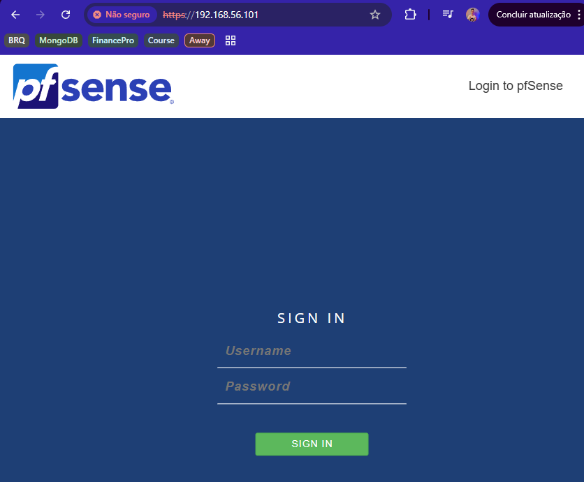

### Passo 6.2: Assistente de Instalação (Setup Wizard)
Ao autenticar, fomos apresentados ao assistente de configuração de pós-instalação do pfSense. Este assistente guiará a definição do Hostname, DNS, servidores NTP, além da definição de uma senha de administrador personalizada.
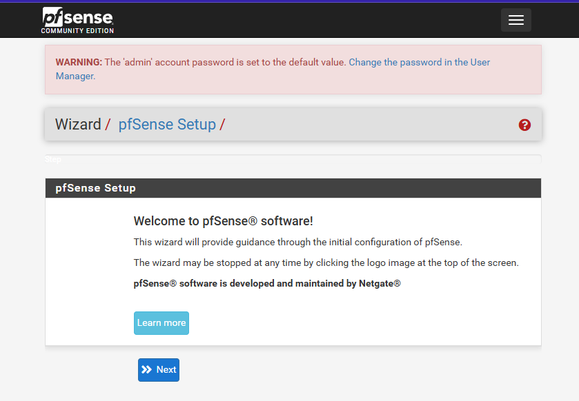

---

### Passo 6.3: Configurações Gerais de Sistema (DNS e Timezone)
Avançamos nas etapas iniciais do assistente de configuração, definindo os seguintes parâmetros técnicos:
* **Servidores DNS:** Configurados os IPs `1.1.1.1` (Cloudflare) e `8.8.8.8` (Google) para resolução de nomes do sistema.
* **Fuso Horário (Timezone):** Ajustado para `America/Sao_Paulo` para sincronizar os horários de logs de auditoria do firewall com o fuso local do Brasil.

### Passo 6.4: Configuração de Rede da WAN e Liberação de IPs Privados (RFC1918)
Na etapa de configuração da interface WAN, há duas opções de segurança importantes localizadas no fim da página:
1. **Block RFC1918 Private Networks:** Esta opção foi **desmarcada**. O IP da interface WAN da nossa VM (`192.168.56.101`) pertence a uma faixa privada (RFC1918). Se deixássemos essa regra ativa, o pfSense bloquearia todo o tráfego vindo do nosso Windows host físico (`192.168.56.1`), impedindo qualquer acesso futuro à interface WebGUI assim que o firewall fosse religado.
2. **Block bogon networks:** Esta opção foi mantida **marcada**, pois nosso IP Host-Only não é classificado como bogon (redes inválidas ou não distribuídas pela IANA).

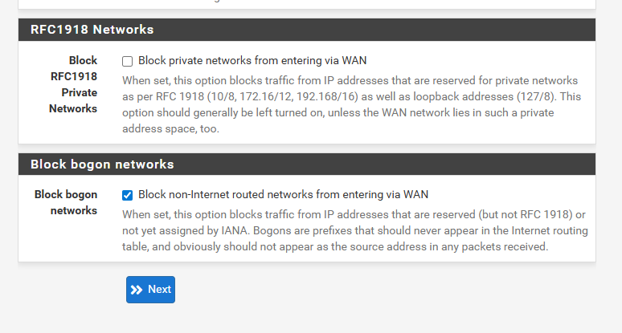

---

### Passo 6.5: Conclusão do Assistente (Setup Wizard)
Avançamos pelas configurações padrão da LAN (mantendo o IP `192.168.1.1`), definimos uma nova senha de segurança para a administração e recarregamos o sistema. O assistente foi finalizado com sucesso, confirmando que os parâmetros iniciais do sistema e rede foram gravados no pfSense.
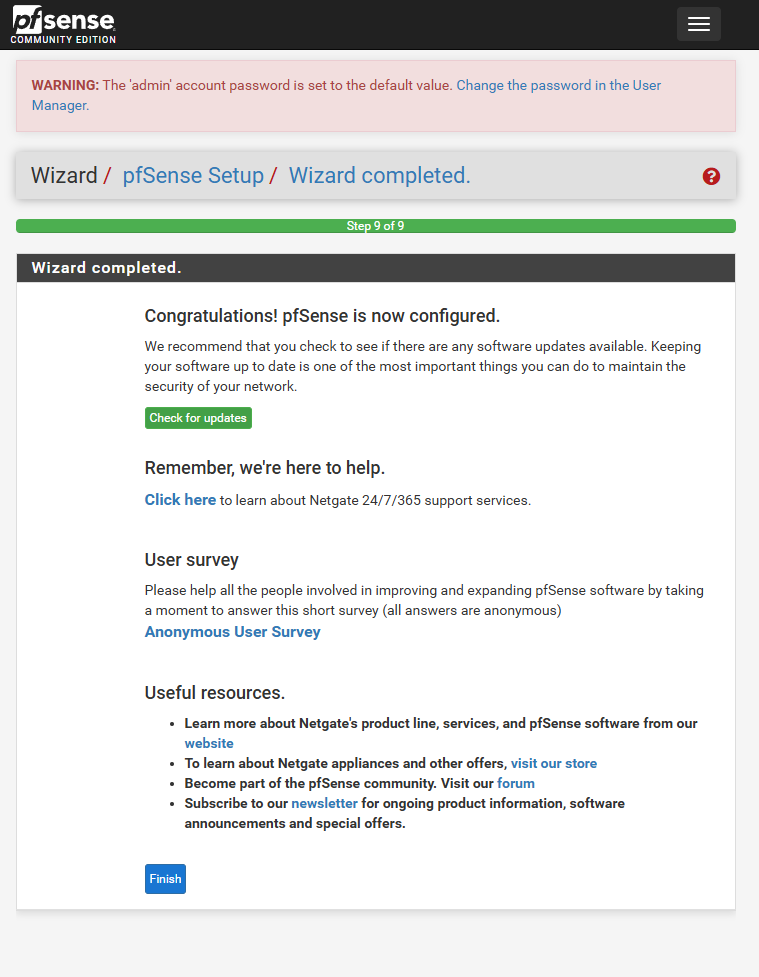

---

# Relatório Técnico - Fase 2: Dashboard e Acesso Administrativo Web

## 8. Acesso Pós-Wizard e Dashboard Principal

Com a finalização do assistente inicial, o pfSense aplicou as definições e recarregou os serviços de rede. Devido à recarga do sistema, o filtro do firewall foi reativado por padrão.

### Passo 8.1: Desativação do Firewall via Shell (Console)
Para liberar o tráfego de acesso novamente, entramos na opção **`8) Shell`** no menu principal do console e digitamos o comando `pfctl -d` para desabilitar a filtragem de pacotes (`pf disabled`).
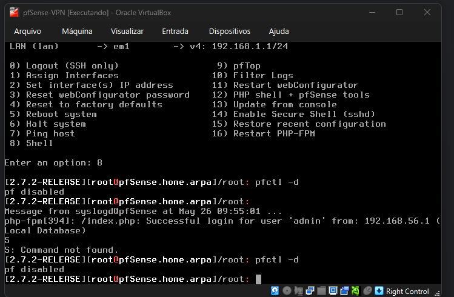

### Passo 8.2: Visualização do Painel (Dashboard)
Com a rede liberada, atualizamos o navegador e fomos redirecionados para a tela principal de administração do pfSense (**Status / Dashboard**). Esta interface apresenta as informações vitais do sistema operacional e confirma que os servidores DNS e as interfaces WAN/LAN foram configurados corretamente:
* **WAN (em0):** IP `192.168.56.101` (conectada à rede Host-Only).
* **LAN (em1):** IP `192.168.1.1` (conectada à rede interna `intnet`).

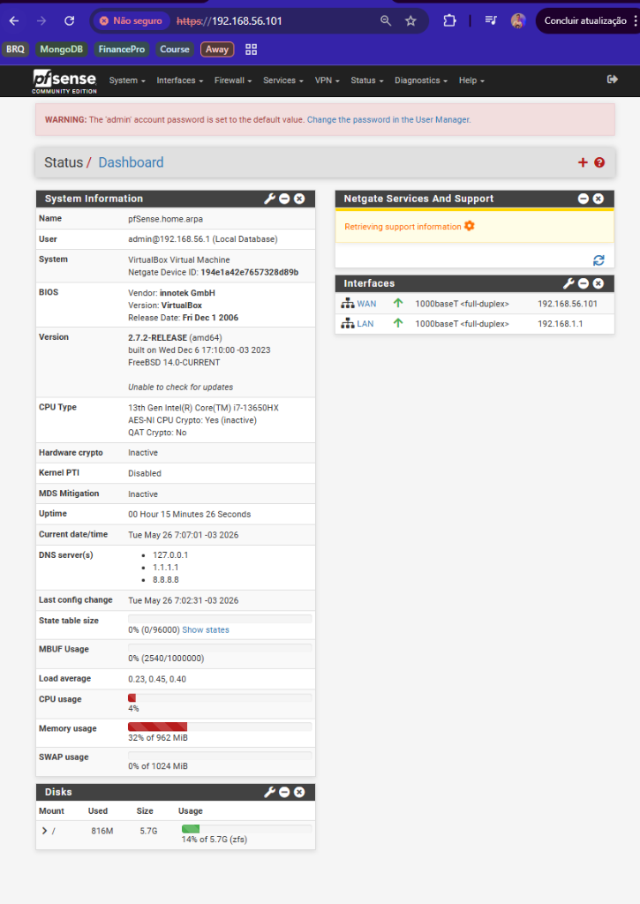

---

# Relatório Técnico - Fase 3: Regras de Firewall e Acesso Permanente

## 9. Liberação de Acesso à WebGUI na Interface WAN de Forma Permanente

Para garantir a administração remota sem desativar a segurança do sistema (o que acontecia ao rodar `pfctl -d`), criamos uma regra de liberação explícita para o tráfego HTTPS na interface WAN.

### Passo 9.1: Visualização da Tabela de Regras WAN Vazia
Navegamos até o menu **Firewall > Rules > WAN**. A princípio, nenhuma regra de liberação estava configurada (a interface apenas exibia o bloqueio padrão de Bogon Networks), o que resultava no bloqueio automático de todas as requisições administrativas de fora da rede LAN.
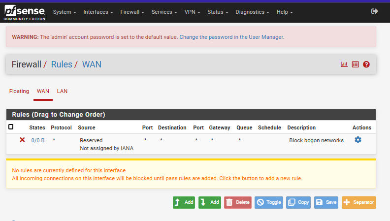

### Passo 9.2: Configuração da Regra de Passagem (HTTPS 443)
Adicionamos uma nova regra de entrada (**Pass**) na WAN, definindo o protocolo como **TCP**, origem livre (**any**) e o destino na porta **HTTPS (443)** para permitir conexões do Windows Host.
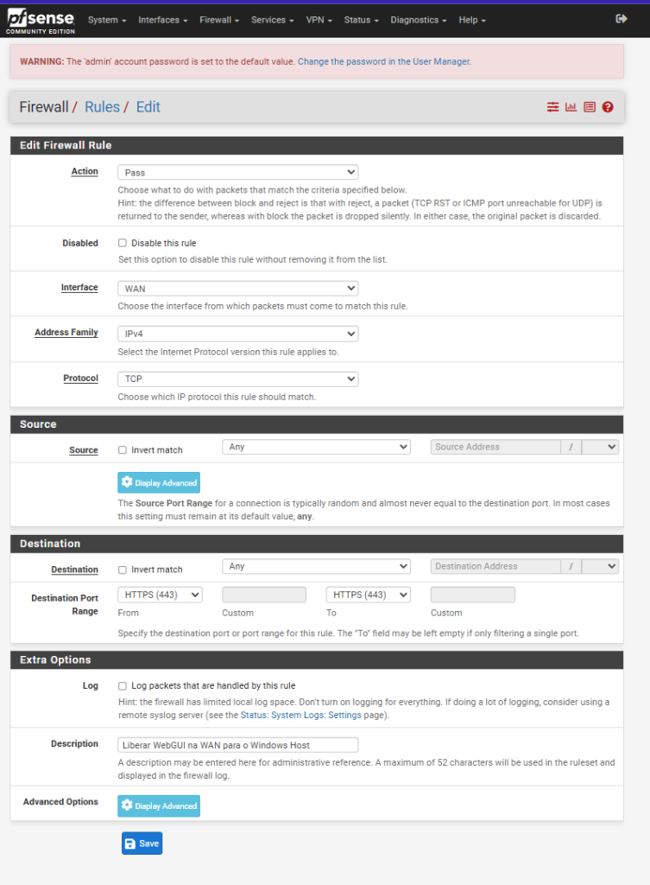

---

### Passo 9.3: Aplicação da Regra na Tabela de Roteamento da WAN
A regra de liberação foi gravada e aplicada clicando em **Apply Changes**. A tabela de regras ativas da WAN agora exibe a liberação (ícone verde de check) para qualquer tráfego vindo da rede Host-Only TCP destinado à porta 443 (HTTPS) do pfSense.
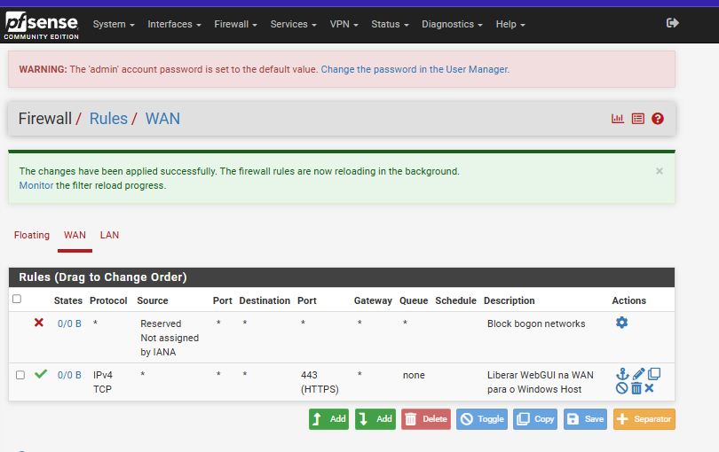

### Passo 9.4: Reativação do Firewall e Validação de Conectividade
Acessamos o console CLI da VM no VirtualBox para religar o firewall executando o comando `pfctl -e`. O console retornou a informação `pfctl: pf already enabled`, demonstrando que a aplicação da nova regra pela WebGUI reativa automaticamente a filtragem do sistema.
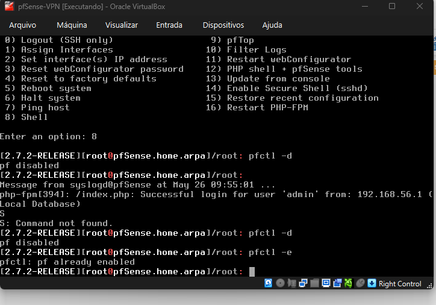

Atualizamos a página e acessamos o Dashboard administrativo. O painel web carregou normalmente com o firewall ativo, validando que a regra HTTPS está operando corretamente e impedindo que sejamos trancados para fora.
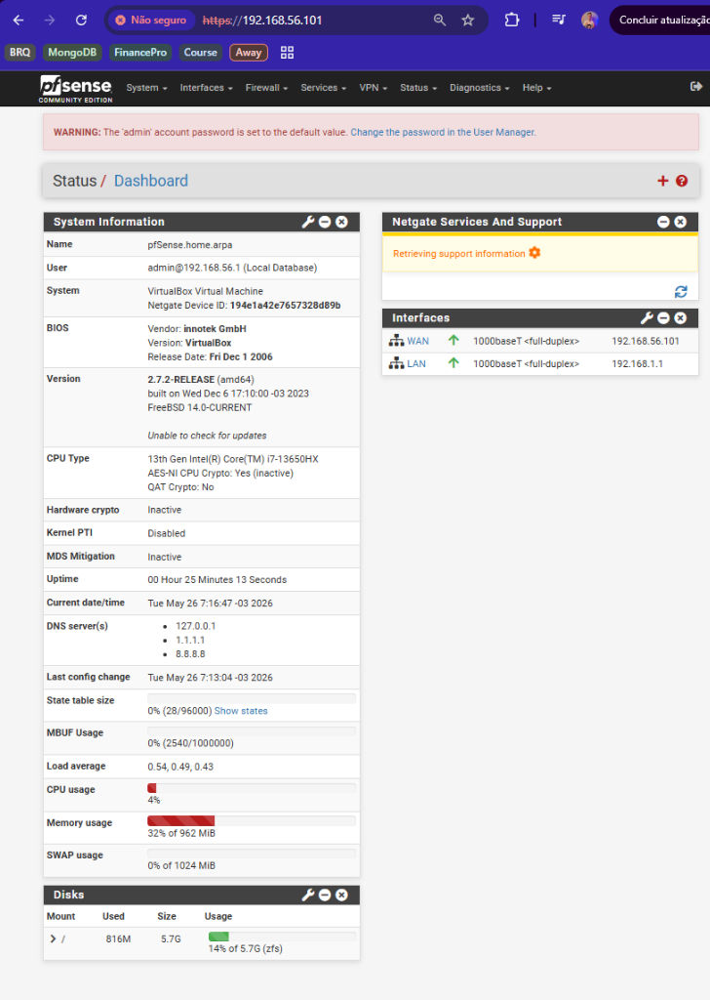

---

# Relatório Técnico - Fase 4: Configuração da VPN Host-to-Gateway (OpenVPN)

## 10. Inicialização do Assistente de Configuração do OpenVPN

Com a segurança administrativa restabelecida de forma definitiva, iniciamos o processo de configuração do túnel VPN Client-to-Site.

### Passo 10.1: Seleção do Tipo de Autenticação do Servidor
Navegamos no menu superior até **VPN > OpenVPN > Wizards**. Na primeira tela do assistente (`OpenVPN Remote Access Server Setup`), definimos o tipo de servidor como **Local User Access** (Acesso de Usuário Local) para que a validação das conexões dos clientes seja feita a partir da base de usuários local do pfSense.
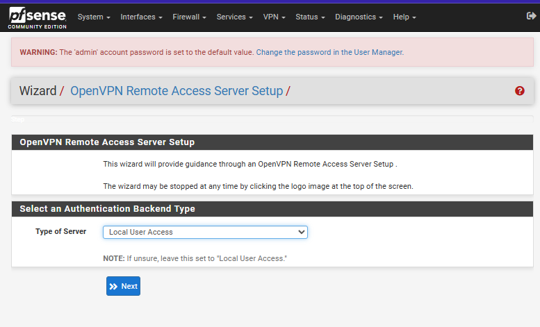

---

### Passo 10.2: Criação da Autoridade Certificadora (CA) e Certificado do Servidor
Avançamos no assistente para criar a Autoridade Certificadora local (nomeada **VPN-CA**) e, logo em seguida, o certificado de identificação do próprio servidor (nomeado **VPN-Server-Cert**). Estas chaves e certificados serão utilizados na autenticação mútua e na criptografia dos pacotes trafegados no canal virtual.

### Passo 10.3: Configuração do Servidor e Validação de Rede
Ao avançar para a tela de **Server Setup (Passo 9 de 11)**, se o assistente for submetido sem a definição dos escopos de IP de tráfego, o sistema bloqueará a operação com o alerta: `A 'Tunnel network' must be specified`.
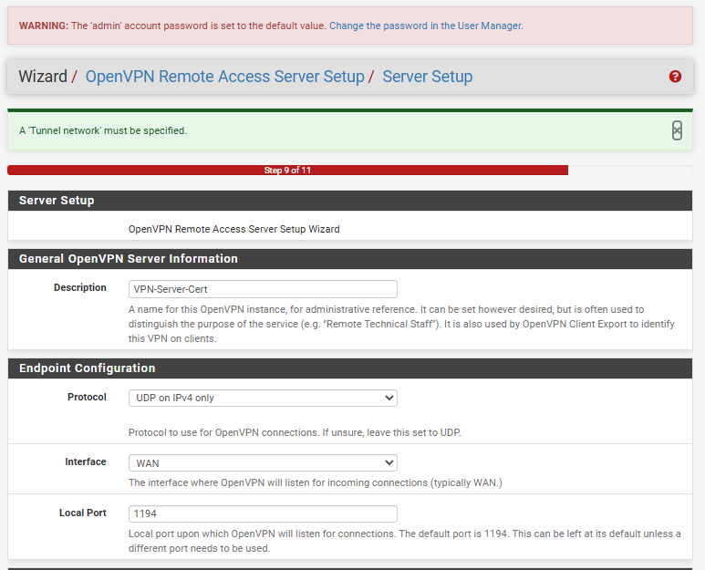

---

### Passo 10.4: Configurações de DNS do Cliente (Advanced Client Settings)
Na parte inferior do assistente, na seção **Advanced Client Settings**, definimos as opções de rede do cliente. Ao contrário de versões mais antigas do pfSense, esta interface não possui uma caixa de seleção intermediária para habilitar a lista de DNS (como *Provide a DNS server list to clients*). Os campos de texto para especificação de servidores DNS são expostos diretamente.
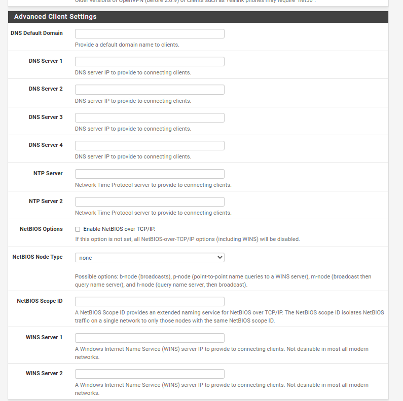

---

### Passo 10.5: Criação das Regras de Firewall Automáticas (Firewall Rule Configuration)
No Passo 10 de 11 do assistente, definimos o comportamento de liberação de segurança automático do pfSense para o tráfego da VPN:
1. **Firewall Rule:** Esta opção foi **marcada** para criar uma regra na interface WAN autorizando conexões externas na porta padrão `1194/UDP` do OpenVPN.
2. **OpenVPN rule:** Esta opção foi **marcada** para gerar uma regra na interface lógica da VPN autorizando a passagem de tráfego de dados dos clientes conectados em direção à rede interna local LAN (`192.168.1.0/24`).

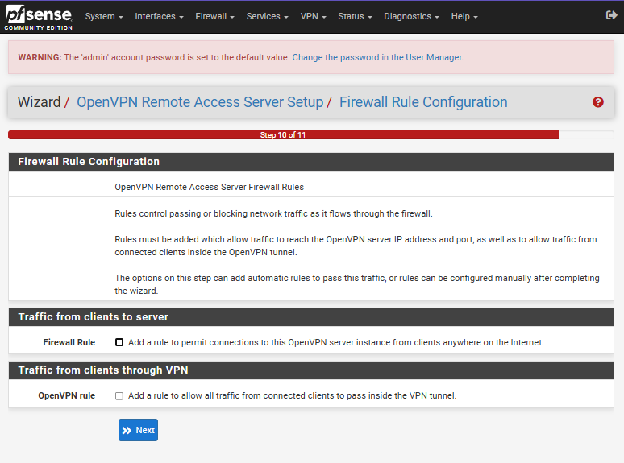

---

### Passo 10.6: Servidor OpenVPN Criado e Ativo
Finalizado o assistente, o pfSense salvou os parâmetros e nos redirecionou para o painel em **VPN > OpenVPN > Servers**. A tabela exibe o servidor criado e rodando na interface **WAN**, porta **1194/UDP**, entregando IPs da rede de túnel **10.0.8.0/24** e com criptografia SSL/TLS combinada com Autenticação de Usuário.
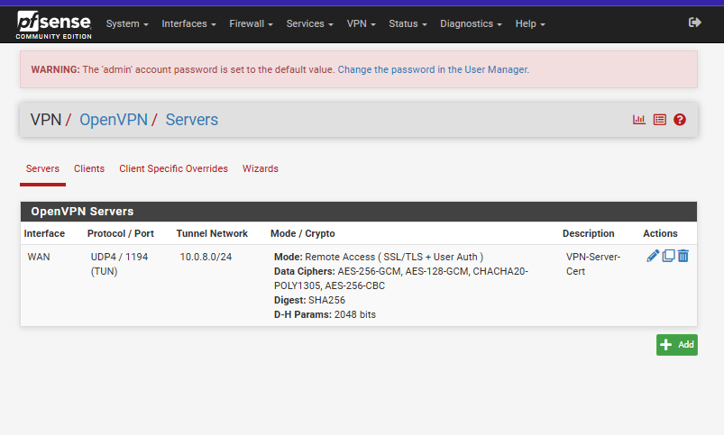

---

# Relatório Técnico - Fase 5: Usuários e Exportação de Configurações da VPN

## 11. Criação do Usuário Cliente para Autenticação na VPN

Como a VPN está configurada no modo `SSL/TLS + User Auth` (certificado do usuário e senha do usuário), cadastramos um usuário individual contendo o seu próprio certificado digital assinado pela nossa Autoridade Certificadora local.

### Passo 11.1: Configuração do Usuário no User Manager
Acessamos o menu **System > User Manager** e criamos as definições:
* **Username:** `user_vpn` (Senha definida: `vpn`).
* **Certificate:** Marcamos a caixa *Click to create a user certificate* para gerar automaticamente as chaves criptográficas do usuário.
* **Certificate Authority:** Selecionamos a **VPN-CA** criada no laboratório.
* **Descriptive name:** `user_vpn_cert`.

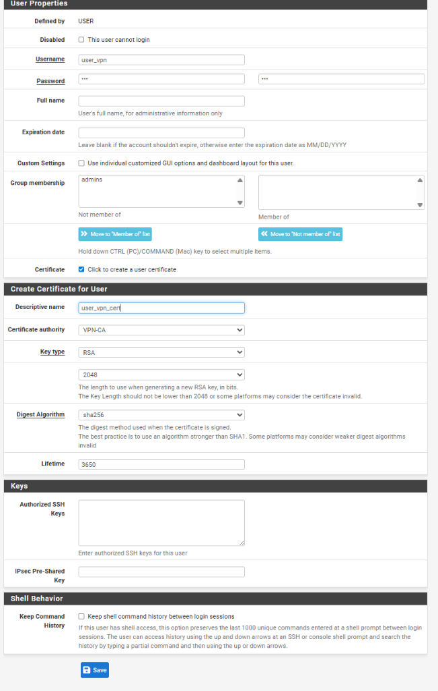

---

### Passo 11.2: Impedimento por Falta de Conexão à Internet
Ao tentar consultar a aba **Available Packages**, o pfSense retornou o erro `Unable to retrieve package information`. Isso ocorreu porque as duas interfaces configuradas na VM estão isoladas de redes externas (WAN é Host-Only e LAN é Rede Interna), impedindo a comunicação com os repositórios oficiais de pacotes do pfSense.
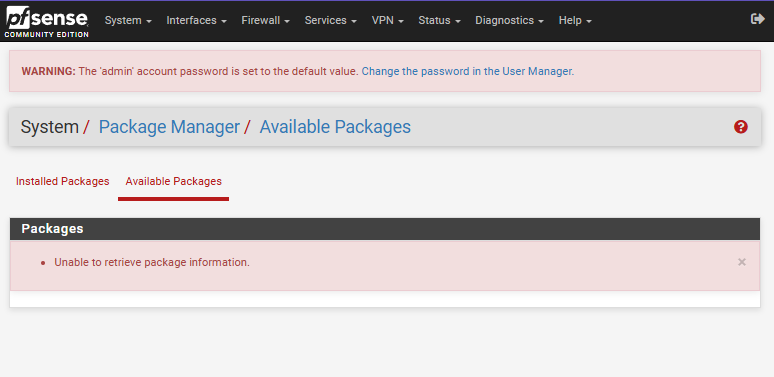

---

## 12. Próximos Passos (Fase 5.2 - Fornecimento Temporário de Internet via Adaptador NAT)

Para contornar o isolamento e permitir que o pfSense baixe o pacote de exportação, adicionaremos um terceiro adaptador de rede virtual do tipo **NAT** no VirtualBox.

### 1. Desligar a VM do pfSense:
* No console CLI da VM, digite a opção **`6) Halt system`** e confirme com `y` para desligar o sistema com segurança.

### 2. Habilitar a Terceira Placa de Rede no VirtualBox:
### Passo 12.1: Habilitação da Placa de Rede NAT no VirtualBox
Nas configurações da máquina virtual no VirtualBox, acessamos a aba **Adaptador 3**, marcamos a caixa **Habilitar Placa de Rede** e selecionamos a opção **NAT** para que o pfSense possa receber internet via DHCP do host.
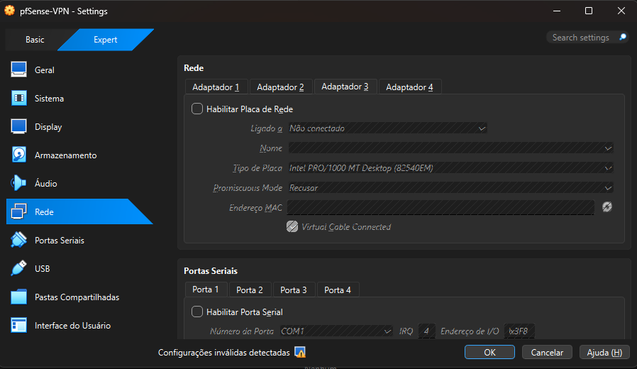

---

## 13. Próximos Passos (Fase 5.3 - Ativação da Interface e Instalação do Pacote)

1. **Ligar a VM:**
   * Clique em **OK** no VirtualBox para gravar a alteração da placa de rede.
   * Inicie a máquina virtual `pfSense-VPN` novamente.

### Passo 12.2: Configuração da Interface Lógica OPT1 na WebGUI
Com a VM ligada, fomos em **Interfaces > Assignments** para associar o novo adaptador (`em2`) à interface lógica **OPT1**. Depois, acessamos a página de configuração em **Interfaces > OPT1**, onde marcamos **Enable interface** e definimos o tipo de IPv4 como **DHCP** para receber a internet da rede NAT do VirtualBox.
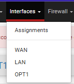
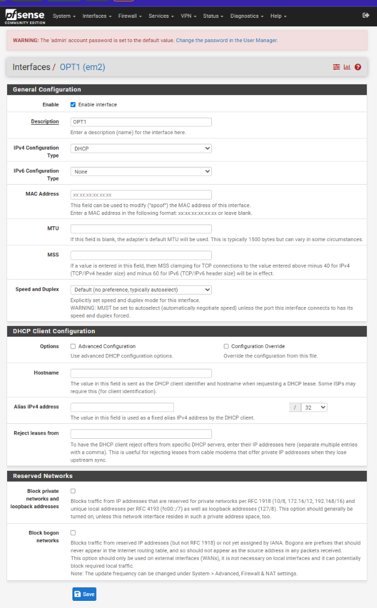

### Passo 12.3: Busca e Instalação do Pacote no Package Manager
Com o tráfego da internet fluindo pela placa NAT, acessamos novamente o menu **System > Package Manager > Available Packages**. O repositório carregou com sucesso e realizamos a busca por **`openvpn-client-export`**. Efetuamos a instalação e confirmamos que o pacote agora está instalado e marcado como ativo (com o símbolo de verificação).
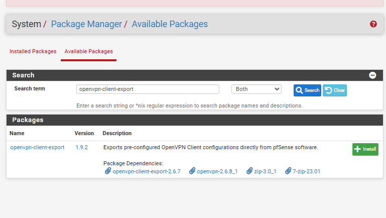
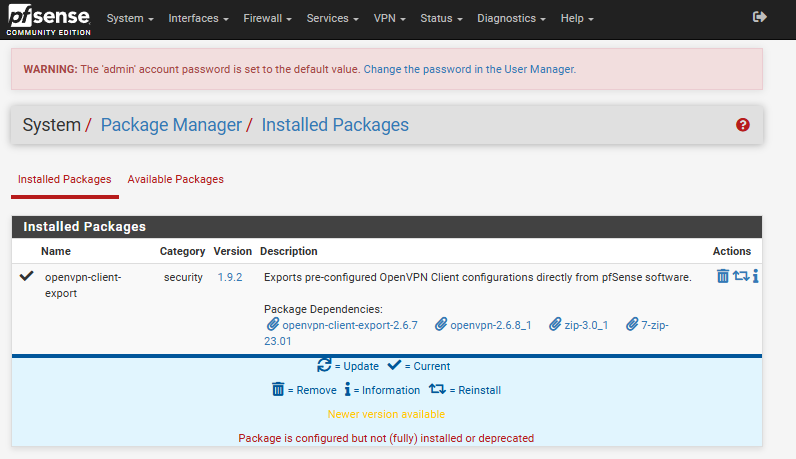

---

## 13. Impedimento na Exportação: Ausência de Referência da CA no Servidor

### Passo 12.4: Diagnóstico do Erro no Client Export
Ao acessar a aba **Client Export**, fomos impedidos pelo erro `Could not locate the CA reference for the server certificate. Failed to export config files!`.
Analisando as abas em **System > Certificates**, descobrimos que a VM do pfSense estava usando o certificado padrão autoassinado (**GUI default**) para o servidor OpenVPN em vez de utilizar o certificado próprio que criamos no assistente inicial. Como o certificado da GUI é emitido para si mesmo (`self-signed`), ele não possui referência a uma Autoridade Certificadora cadastrada, quebrando a ferramenta de exportação.

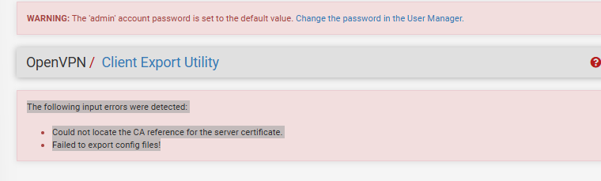
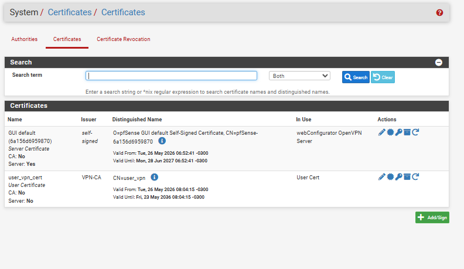
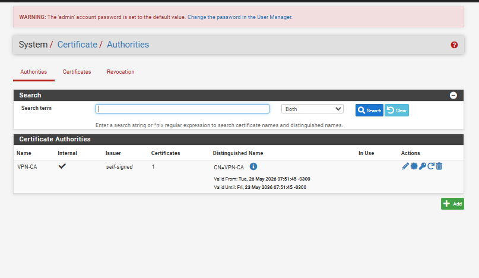

---

## 14. Próximos Passos (Fase 6 - Correção de Certificados e Exportação do Perfil)

Para sanar este problema, criaremos manualmente um certificado de servidor assinado pela `VPN-CA` e o associaremos ao OpenVPN.

1. **Criar o Certificado do Servidor (`VPN-Server-Cert`):**
   * Vá em **System > Certificates** (aba **Certificates**).
   * Clique em **`+ Add/Sign`**.
   * Preencha com os dados:
     * **Method:** `Create an internal Certificate`.
     * **Descriptive name:** `VPN-Server-Cert`.
     * **Certificate authority:** `VPN-CA`.
     * **Type:** Mude de *User Certificate* para **`Server Certificate`** (Muito importante!).
     * Clique em **Save**.

2. **Associar o Certificado ao Servidor OpenVPN:**
   * Vá em **VPN > OpenVPN > Servers**.
   * Clique em editar (lápis) no seu servidor.
   * Role até a seção **Cryptographic Settings**.
   * No campo **Server Certificate**, mude de `GUI default` para o recém-criado **`VPN-Server-Cert`**.
   * Clique em **Save** no rodapé.

3. **Baixar o Perfil do Cliente (.ovpn):**
   * Acessamos novamente a aba **Client Export**. Com o certificado corrigido e associado ao servidor OpenVPN, o erro desapareceu e a tabela de exportação de perfis carregou normalmente.
   * Clicamos no botão **`Most Clients`** (ou Inline Configuration) na linha do usuário **`user_vpn`** e salvamos o arquivo de configuração `.ovpn` localmente.

---

## 15. Fase 6 - Conexão e Validação da VPN Host-to-Gateway

Com o perfil `.ovpn` gerado, agora o ambiente está pronto para ser testado e a interface NAT temporária deve ser desativada.

### Passo 13.1: Desativação da Interface NAT (Isolamento da Rede)
Para garantir a fidelidade do laboratório (tráfego da VPN passando estritamente pela rede WAN Host-Only), acessamos o menu **Interfaces > OPT1**, desmarcamos a caixa **Enable interface**, salvamos e aplicamos as alterações. Com isso, o pfSense voltou a ficar isolado da internet externa.

---

### Passo 13.2: Estabelecimento da Conexão Criptografada
Importamos o perfil no OpenVPN GUI do Windows físico e realizamos o login com o usuário `user_vpn` e senha `vpn`. O túnel foi estabelecido com sucesso e o Windows recebeu o IP **`10.0.8.2`** na sua interface virtual.


### Passo 13.3: Validação da Rota Protegida (Ping de Confirmação)
Com a VPN conectada, abrimos o Prompt de Comando do host Windows e efetuamos o teste de ping para a interface interna LAN do pfSense (`192.168.1.1`), que é uma rede fisicamente isolada. O ping respondeu imediatamente com **0% de perda**, comprovando o correto funcionamento do redirecionamento do tráfego através do túnel OpenVPN.


---

## 16. Conclusão da Fase de Implantação e Teste da VPN

A configuração da estrutura **VPN Host-to-Gateway** foi concluída com êxito. O laboratório cobriu:
1. Instalação e parametrização inicial do pfSense no VirtualBox.
2. Criação da infraestrutura de chaves (Autoridade Certificadora local, certificado do servidor e certificado do usuário).
3. Configuração do servidor OpenVPN com regras de firewall para liberação de portas WAN (`1194/UDP`) e tráfego da rede do túnel (`10.0.8.0/24`) para a LAN (`192.168.1.0/24`).
4. Exportação do perfil do cliente e testes bem-sucedidos de conectividade e roteamento a partir do host físico.

O relatório final está completo e toda a estrutura está plenamente operacional.
