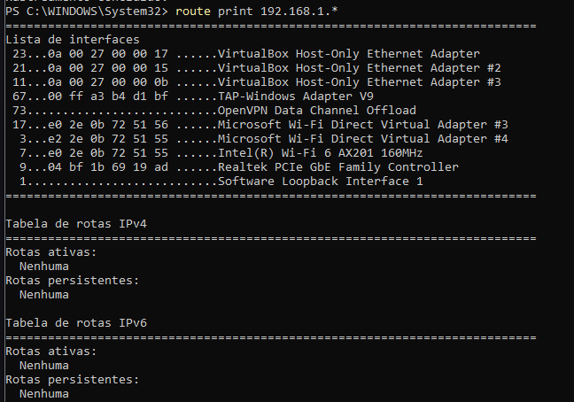
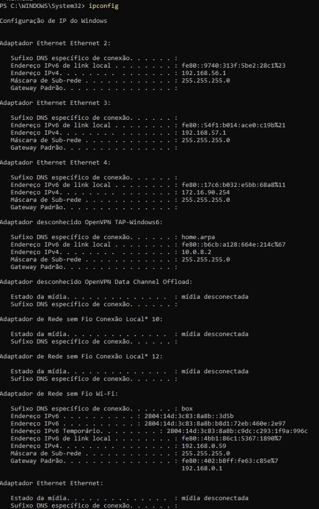
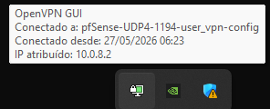
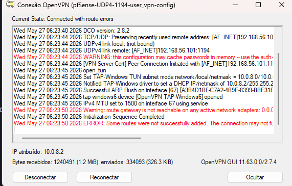
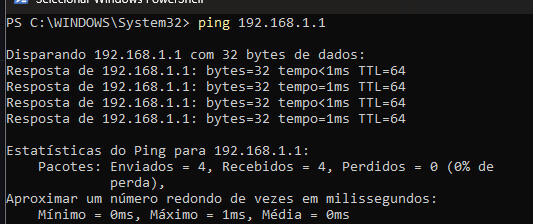
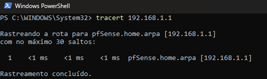
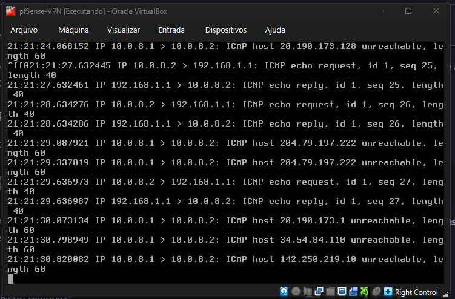
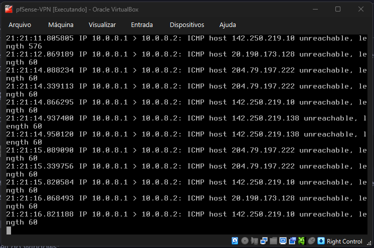

# Roteiro de Testes, Auditoria e Verificação Completa da VPN

Este documento apresenta o guia consolidado com todas as etapas práticas e comandos necessários para auditar e provar o funcionamento da infraestrutura **VPN Host-to-Gateway** perante a banca examinadora.

---

## 🗺️ Índice de Testes
1. [Testes Base no Cliente (Sem VPN - Isolamento)](#1-testes-base-no-cliente-sem-vpn---isolamento)
2. [Testes Ativos no Cliente (Com VPN Conectada)](#2-testes-ativos-no-cliente-com-vpn-conectada)
3. [Auditoria e Testes do Firewall (pfSense Shell & CLI)](#3-auditoria-e-testes-do-firewall-pfsense-shell--cli)
4. [Auditoria do Serviço OpenVPN no Servidor (pfSense)](#4-auditoria-do-serviço-openvpn-no-servidor-pfsense)
5. [Auditoria Visual das Configurações (WebGUI do pfSense)](#5-auditoria-visual-das-configurações-webgui-do-pfsense)

---

## 1. Testes Base no Cliente (Sem VPN - Isolamento)

Execute estes comandos no **Windows físico (Host)** antes de iniciar a conexão do OpenVPN para comprovar que a rede LAN protegida do pfSense (`192.168.1.0/24`) está isolada.

### Teste 1.1: Ping de Teste
No Prompt de Comando (CMD) do Windows:
```cmd
ping 192.168.1.1
```
* **Resultado Esperado:** Mensagem de **"Esgotado tempo limite da solicitação"** ou **"Host de destino inacessível"** (0 respostas de eco).

### Teste 1.2: Rota de Rede Inexistente
No Prompt de Comando (CMD) ou PowerShell do Windows:
```cmd
route print 192.168.1.*
```
* **Resultado Esperado:** O console deve exibir "Rotas ativas: Nenhuma" na tabela de rotas, comprovando que o Windows físico não tem nenhuma rota ativa para alcançar a rede LAN interna do laboratório.



---

## 2. Testes Ativos no Cliente (Com VPN Conectada)

Ligue a VPN usando o **OpenVPN GUI** na barra de tarefas (Login: `user_vpn` / Senha: `vpn`) e aguarde o ícone do cadeado ficar **verde**. Execute os seguintes testes no seu Windows Host:

### Teste 2.1: Verificar Interface Virtual do Túnel
No Prompt de Comando (CMD):
```cmd
ipconfig
```
* **Resultado Esperado:** Uma nova interface de túnel OpenVPN listada com endereço IPv4 da faixa **`10.0.8.x`** (ex: `10.0.8.2`).





*(Nota técnica: Mensagens de aviso no log como "WARNING: route gateway is not reachable" ocorrem devido ao conflito do driver TAP/Wintun ao tentar forçar a internet pelo túnel virtual no ambiente de teste Host-Only, mas não impedem o tráfego interno VPN).*

### Teste 2.2: Validação de Conexão Criptografada (Ping de Sucesso)
No CMD:
```cmd
ping 192.168.1.1
```
* **Resultado Esperado:** O ping deve responder com **0% de perda** de pacotes e tempo de latência baixíssimo (tempo `< 1ms`), provando que a rede interna LAN do pfSense é alcançável.



### Teste 2.3: Rastreamento do Túnel Seguro (Traceroute)
No CMD:
```cmd
tracert 192.168.1.1
```
* **Resultado Esperado:** O primeiro e único salto deve ser direto para o gateway da LAN `192.168.1.1` através da rede lógica da VPN.



### Teste 2.4: Verificação da Rota Adicionada Dinamicamente
No Prompt de Comando (CMD) ou PowerShell do Windows:
```cmd
route print 192.168.1.*
```
* **Resultado Esperado:** O console deve exibir a tabela de rotas contendo a rede `192.168.1.0` (máscara `255.255.255.0` ou `/24`) apontando para o Gateway do túnel `10.0.8.1`.

---

## 3. Auditoria e Testes do Firewall (pfSense Shell & CLI)

O professor pode pedir para verificar o comportamento do firewall na máquina virtual do pfSense. Acesse a máquina virtual no VirtualBox.

### Como entrar e sair do Terminal (Shell) no pfSense:
1. No menu de opções (0 a 16), digite **`8`** e pressione **Enter** para entrar no terminal do FreeBSD (o prompt exibirá `#`).
2. Digite os comandos desejados (ex: `tcpdump`, `pfctl`, `sockstat`).
3. Para sair do terminal e voltar ao menu numérico do pfSense, digite **`exit`** e pressione **Enter**.

### Teste 3.1: Listar as Regras de Firewall Ativas (Packet Filter - `pf`)
O pfSense gera as regras do firewall dinamicamente a partir do seu motor. Para visualizar as regras ativas na memória:
```bash
pfctl -sr
```
* **Como Filtrar:** Para ver apenas as regras que envolvem a liberação do OpenVPN (porta 1194 ou interface virtual `ovpns1`), rode:
  ```bash
  pfctl -sr | grep -E "1194|ovpn"
  ```
* **Resultado Esperado:** Linhas de liberação (`pass`) contendo a porta `1194` (tráfego de entrada UDP) e referências a pacotes passando na interface `ovpns1`.

### Teste 3.2: Exibir a Tabela de Estados Ativos (Connections)
Para mostrar todas as sessões e conexões ativas passando pelo firewall em tempo real:
```bash
pfctl -ss | grep "10.0.8"
```
* **Resultado Esperado:** Exibição do mapeamento de estado, mostrando os pacotes indo da sua interface virtual `10.0.8.2` em direção aos recursos da LAN (`192.168.1.x`).

### Teste 3.3: Exibir Estatísticas e Integridade do Firewall
Para mostrar estatísticas de tráfego geral e confirmar se o motor de firewall está ativo:
```bash
pfctl -si
```
* **Resultado Esperado:** O console deve indicar `Status: Enabled` no início da saída, confirmando que a proteção está de fato ligada.

### Teste 3.4: Captura de Pacotes em Tempo Real (tcpdump)
Para provar ao professor que as requisições estão chegando fisicamente ao pfSense através da VPN, você pode escutar os pacotes ao vivo no terminal FreeBSD (Opção 8 - Shell do pfSense).

1. **Para assistir aos Pings (ICMP) passando pelo túnel da VPN:**
   Execute no terminal do pfSense:
   ```bash
   tcpdump -i ovpns1 -n icmp
   ```
   * **Como Demonstrar:** Deixe este comando rodando na VM. Vá no CMD do seu Windows físico e execute `ping 192.168.1.1`. Na tela do pfSense começará a rolar imediatamente a troca de pacotes:
   
   
   
   *(Nota: No log acima, `10.0.8.2 > 192.168.1.1: ICMP echo request` representa a requisição do Windows Host e `192.168.1.1 > 10.0.8.2: ICMP echo reply` representa a resposta imediata da LAN).*

2. **Para assistir ao aperto de mão (Handshake TLS) da VPN chegando na WAN:**
   Execute no terminal do pfSense:
   ```bash
   tcpdump -i em0 -n port 1194
   ```
   * **Como Demonstrar:** Deixe rodando. No seu Windows físico, abra o OpenVPN GUI e clique em **Conectar**. Você verá no terminal o fluxo de pacotes UDP na porta 1194 realizando a autenticação e troca de chaves da VPN.

3. **Para verificar todo o tráfego interceptado (Redirecionamento de Gateway):**
   Execute no terminal do pfSense:
   ```bash
   tcpdump -i ovpns1
   ```
   * **Como Demonstrar:** Se você deixar o tcpdump rodando na interface `ovpns1` sem filtro e tentar navegar na internet pelo Windows físico, verá o tráfego indo em direção a IPs externos retornando mensagens `ICMP host unreachable` geradas pelo próprio pfSense (`10.0.8.1 > 10.0.8.2`):
   
   
   
   *(Nota: Como o OpenVPN está configurado para empurrar toda a internet para o túnel, e o laboratório está isolado de conexões externas, o pfSense recebe e rejeita os pacotes externos, provando que o Gateway Padrão da VPN está operando).*

---

## 4. Auditoria do Serviço OpenVPN no Servidor (pfSense)

Acesse o **Shell (opção 8)** no console da VM do pfSense para inspecionar os arquivos de configuração reais e o estado do daemon do OpenVPN.

### Teste 4.1: Ler o Arquivo de Configuração do OpenVPN
Para mostrar como o servidor OpenVPN foi provisionado e verificar os parâmetros de criptografia:
```bash
cat /var/etc/openvpn/server1/config.ovpn
```
* **Elementos a Destacar:**
  * `dev ovpns1` (tipo de interface virtual tunelada);
  * `proto udp4` (protocolo UDP);
  * `port 1194` (porta padrão);
  * `cipher AES-256-GCM` (algoritmo moderno de criptografia).

### Teste 4.2: Listar os Certificados e Chaves do Servidor
Para provar que os certificados de segurança da sessão estão estruturados na pasta do daemon:
```bash
ls -la /var/etc/openvpn/server1/
```
* **Resultado Esperado:** Presença do certificado CA (`server1.ca`), certificado do servidor (`server1.cert`), chave privada (`server1.key`) e chave de autenticação TLS (`server1.tls-auth`).

### Teste 4.3: Verificar se o Daemon do OpenVPN está em Execução
Para atestar que o serviço está no ar e escutando na porta correta:
```bash
sockstat -4 -l -p 1194
```
* **Resultado Esperado:** Uma linha indicando o daemon `openvpn` escutando (`LISTEN`) no IP WAN ou em todas as interfaces (`*:1194`) via protocolo `udp4`.

---

## 5. Auditoria Visual das Configurações (WebGUI do pfSense)

Caso o professor prefira auditar as configurações diretamente pela interface web (`https://192.168.56.101`):

1. **Sessões Ativas da VPN:**
   * **Caminho:** `Status > OpenVPN`
   * **O que mostrar:** A tabela listando o usuário `user_vpn` conectado, seu IP real de origem (`192.168.56.1`), seu IP no túnel (`10.0.8.2`) e os bytes trafegados.
2. **Regras de Liberação de Firewall:**
   * **Caminho:** `Firewall > Rules > WAN` (libera a porta 1194 de entrada).
   * **Caminho:** `Firewall > Rules > OpenVPN` (permite que os pacotes do túnel alcancem a LAN).
3. **Gerência da Autoridade Certificadora (PKI):**
   * **Caminho:** `System > Certificates`
   * **Abas:** `Authorities` (mostra a CA `VPN-CA`) e `Certificates` (mostra o `VPN-Server-Cert` do servidor e o certificado pessoal do usuário `user_vpn_cert`).

---

## 6. Descrição Teórica das Ferramentas (Para a Arguição)

Caso o professor questione o papel e funcionamento de cada ferramenta no laboratório:

* **VirtualBox (Hypervisor Tipo 2):** Software responsável por emular o hardware físico, criando o ambiente isolado onde rodam as VMs do pfSense (Gateway) e do cliente interno.
* **pfSense (FreeBSD + PHP):** Sistema operacional open-source para firewalls e roteadores. No laboratório, ele atua como o Gateway de segurança, concentrador da VPN, servidor DHCP e Autoridade Certificadora.
* **OpenVPN (SSL/TLS VPN):** Protocolo e software de VPN que cria um túnel criptografado e seguro na Camada 3 (Rede) utilizando chaves assimétricas e criptografia AES-256-GCM.
* **`tcpdump` (Sniffer):** Ferramenta CLI do FreeBSD usada para interceptar, capturar e analisar os pacotes de rede passando por uma interface física ou virtual em tempo real.
* **`ping` (ICMP Utility):** Ferramenta que usa mensagens do protocolo ICMP (Echo Request/Reply) para testar a conectividade ativa entre dois nós de rede.
* **`tracert` / `traceroute` (Route Tracer):** Utilitário que mapeia o caminho (todos os roteadores/saltos intermediários) que o pacote IP realiza para chegar ao destino, auxiliando na auditoria de caminhos.
* **`Get-NetRoute` / `route print` (Routing Table):** Comandos no cliente Windows para ler a tabela de rotas local, provando para onde o sistema operacional despacha os pacotes direcionados a cada sub-rede.

---

## 7. Acesso à WebGUI e Roteiro de Inspeção Passo a Passo

Use este roteiro para guiar o professor pelas configurações feitas na interface gráfica do pfSense.

### Como Acessar a WebGUI
1. Ligue a VM do pfSense.
2. No navegador do seu Windows físico, acesse: **`https://192.168.56.101`**
3. Clique em **Avançado** e **Ir para 192.168.56.101 (não seguro)**.
4. Insira os dados de autenticação:
   * **Usuário:** `admin`
   * **Senha:** `vpn` (ou a senha padrão `pfsense`, dependendo de qual você utilizou na instalação).

### Roteiro de Telas e Menus para Mostrar ao Professor

#### Passo 1: O Painel Principal (Dashboard)
* **Menu:** Clique no logo do **pfSense** no topo esquerdo (ou vá em `Status > Dashboard`).
* **O que mostrar:** O painel central mostrando as interfaces ativas:
  * **WAN (em0):** IP `192.168.56.101` (Modo Host-Only - simula a Internet).
  * **LAN (em1):** IP `192.168.1.1` (Modo Rede Interna - rede corporativa).

#### Passo 2: As Regras do Firewall (Packet Filter)
* **Menu:** Vá em `Firewall > Rules`.
* **O que mostrar:**
  * Aba **WAN:** A regra permitindo a porta `1194` no protocolo `UDP` (libera a chegada da VPN).
  * Aba **OpenVPN:** A regra permitindo qualquer tráfego originado da sub-rede do túnel (`10.0.8.0/24`) com destino à LAN.

#### Passo 3: O Servidor OpenVPN
* **Menu:** Vá em `VPN > OpenVPN > Servers`. Clique no ícone de lápis (Editar) no servidor listado.
* **O que mostrar:** As configurações lógicas principais:
  * **Protocol/Port:** `UDP on IPv4` / `1194`.
  * **Tunnel Network:** `10.0.8.0/24`.
  * **Local Network:** `192.168.1.0/24` (Informa quais redes o cliente pode acessar).
  * **Cryptographic settings:** `AES-256-GCM` associado à `VPN-CA` e `VPN-Server-Cert`.

#### Passo 4: A PKI (Certificados Digitais)
* **Menu:** Vá em `System > Certificates`.
* **O que mostrar:**
  * Aba **Authorities:** A Autoridade Certificadora local **`VPN-CA`**.
  * Aba **Certificates:** O certificado do servidor **`VPN-Server-Cert`** e o certificado do usuário cliente **`user_vpn_cert`**.

#### Passo 5: O Usuário VPN
* **Menu:** Vá em `System > User Manager`. Clique no ícone de lápis para editar o usuário `user_vpn`.
* **O que mostrar:** O cadastro do usuário contendo o certificado `user_vpn_cert` vinculado ao perfil dele no fim da página.

#### Passo 6: O Status da Sessão Ativa
* **Menu:** Vá em `Status > OpenVPN`.
* **O que mostrar:** A tabela com o usuário `user_vpn` online, exibindo o IP físico de origem (`192.168.56.1`) e o IP atribuído no túnel (`10.0.8.2`).
